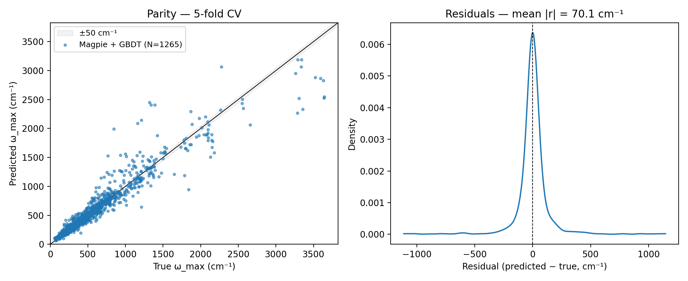

# phonon-omega-max

Regression of ω_max (last-peak phonon frequency, cm⁻¹) for 1,265
inorganic crystals on the Matbench `phonons` task, comparing a
composition-only Magpie + GBDT baseline against a hand-implemented
structure-based CGCNN.



## Leaderboard

_filled in after run_ — see `figures/leaderboard.md`.

## Reproduce

```bash
git clone <repo-url>
cd phonon-omega-max
python3.12 -m venv .venv && source .venv/bin/activate
pip install -e ".[dev]"
pip install "numpy>=1.26,<2.0"   # torch 2.2.2 was built against NumPy 1.x
make all
```

Wall time on a laptop CPU: ~5 hours. The Matbench dataset is fetched
directly from Materials Project's ML data cache on first run (no API
key needed). All later runs reuse the parquet cache under
`data/cache/`.

On macOS, the Makefile exports `OMP_NUM_THREADS=1`,
`MKL_NUM_THREADS=1`, and `KMP_DUPLICATE_LIB_OK=TRUE` to keep torch and
the rest of the OpenMP-using stack from stepping on each other.

## Layout

- `phonon_omegamax/` — the package
- `notebooks/walkthrough.ipynb` — single-fold demo
- `configs/` — per-model hyperparameters (also documented in `docs/methods.md`)
- `docs/` — data card, methods, physics findings
- `figures/` — versioned headline figure + leaderboard table
- `metrics/` — per-fold JSON + summary JSON, written by `make all`

## Limitations

- Five seeds × five outer folds is a real CPU budget; if wall-clock
  runs long, dropping to three seeds is a documented escape hatch.
- Equivariant nets (e3nn, NequIP, MACE) are not implemented — future
  work.
- The target is a single derived scalar (ω_max), not the full DOS
  curve. The structure-vs-composition ablation is set up so that
  extending to DOS regression is a single-file change.

## Acknowledgements

Phonon data and structures from the Materials Project (CC-BY 4.0),
delivered via the same JSON the Matbench benchmark distributes.
